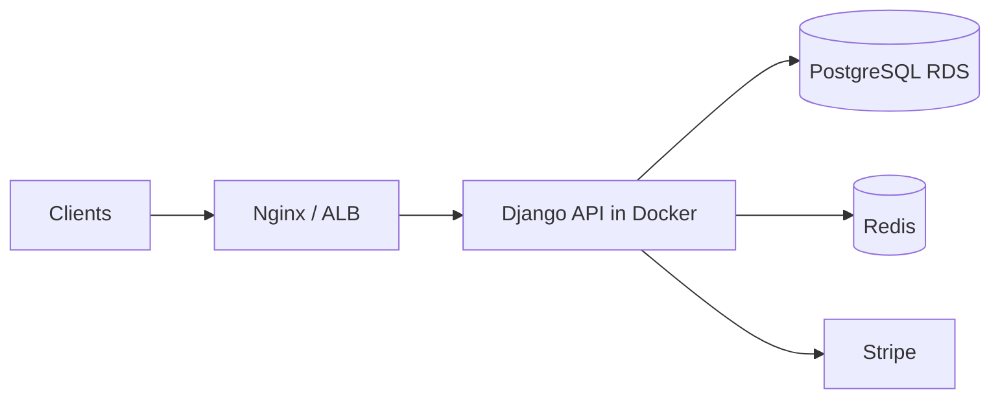

# {{PROJECT_NAME}}

{{ONE_LINE_TAGLINE}}

[]({{BADGE_1_LINK}})
[]({{BADGE_2_LINK}})

---

## Table of contents

- [About](#about)
- [Features](#features)
- [Documentation](#documentation)
- [Tech stack](#tech-stack)
- [Architecture at a glance](#architecture-at-a-glance)
- [Prerequisites](#prerequisites)
- [Quick start](#quick-start)
- [Configuration](#configuration)
- [API overview](#api-overview)
- [Project structure](#project-structure)
- [Deployment](#deployment)
- [Testing](#testing)
- [Maintaining documentation](#maintaining-documentation)
- [Contributing](#contributing)
- [Security & compliance](#security--compliance)
- [License](#license)

---

## About

{{PROJECT_DESCRIPTION_PARAGRAPH_1}}

{{PROJECT_DESCRIPTION_PARAGRAPH_2}}

| | |
|---|---|
| **Version** | {{VERSION}} |
| **Status** | {{STATUS}} |
| **Primary API prefix** | {{API_PREFIX}} |
| **Live / health check** | [{{HEALTH_URL}}]({{HEALTH_URL}}) |
| **OpenAPI (Swagger)** | [{{SWAGGER_URL}}]({{SWAGGER_URL}}) |

---

## Features

Short list for the README; full detail lives in generated docs.

- {{FEATURE_1}}
- {{FEATURE_2}}
- {{FEATURE_3}}
- {{FEATURE_4}}

See [Project Features](docs/generated/ProjectFeature.md) for the complete feature breakdown.

---

## Documentation

This repository keeps **structured source** in `docs/source/` (YAML frontmatter + notes) and **human-readable docs** in `docs/generated/`, produced by `docs/yaml_to_markdown.py`. The TypeScript contract for portfolio tools is `docs/source/schema.ts`.

### Documentation index

| Document | What you will find | Read |
|----------|-------------------|------|
| **Overview** | Problem, solution, metrics, links | [ProjectOverview.md](docs/generated/ProjectOverview.md) |
| **Metadata** | Project id, version, tech stack, URLs | [ProjectMetadata.md](docs/generated/ProjectMetadata.md) |
| **API schema** | Endpoints, auth, rate limits, examples | [APISchema.md](docs/generated/APISchema.md) |
| **Architecture** | Layers, patterns, diagram, data flows | [ProjectArchitecture.md](docs/generated/ProjectArchitecture.md) |
| **Infrastructure** | Docker, EC2/ECS, RDS, Redis, cloud services | [ProjectInfrastructure.md](docs/generated/ProjectInfrastructure.md) |
| **Features** | Feature cards, snippets, status per area | [ProjectFeature.md](docs/generated/ProjectFeature.md) |
| **Code showcase** | Curated code examples from the codebase | [ProjectCodeShowCase.md](docs/generated/ProjectCodeShowCase.md) |
| **Generated index** | Auto-generated hub linking all of the above | [docs/generated/README.md](docs/generated/README.md) |

### Source vs generated

| Path | Purpose |
|------|---------|
| `docs/source/*.md` | Edit YAML frontmatter here (machine-friendly, matches `schema.ts`) |
| `docs/generated/*.md` | Read here on GitHub / in the IDE (do not edit by hand) |
| `docs/yaml_to_markdown.py` | Regenerates `docs/generated/` from `docs/source/` |

```bash
pip install pyyaml
python docs/yaml_to_markdown.py
```

---

## Tech stack

{{TECH_STACK_BULLETS}}

---

## Architecture at a glance

{{ARCHITECTURE_SUMMARY}}



Full diagram, layers, and decisions: [ProjectArchitecture.md](docs/generated/ProjectArchitecture.md).

---

## Prerequisites

- Python {{PYTHON_VERSION}}+
- pip / venv
- Docker & Docker Compose (for container deploy)
- PostgreSQL and Redis (production; SQLite used locally in development)
- {{OPTIONAL_PREREQ}}

---

## Quick start

### Local development

```bash
git clone {{REPO_URL}}
cd {{REPO_DIR}}
python -m venv .venv
source .venv/bin/activate   # Windows: .venv\Scripts\activate
pip install -r requirements.txt
cp .env.example .env        # adjust for local dev

export DJANGO_SETTINGS_MODULE=config.settings.development
python manage.py migrate
python manage.py runserver
```

- Health: http://127.0.0.1:8000/api/v2/health/
- Swagger: http://127.0.0.1:8000/api/v2/schema/swagger-ui/

### Docker (production settings)

```bash
cp .env.example .env        # point DB_HOST / REDIS_HOST to cloud instances
docker compose -f docker/docker-compose.yml up --build -d
```

API on host port **8001** → container **8000**. See [ProjectInfrastructure.md](docs/generated/ProjectInfrastructure.md).

---

## Configuration

Copy `.env.example` to `.env`. Minimum variables for production:

| Variable | Description |
|----------|-------------|
| `SECRET_KEY` | Django secret |
| `DB_*` | PostgreSQL (e.g. RDS) |
| `REDIS_HOST` / `REDIS_PORT` | Cache, rate limits, Celery broker |
| `ALLOWED_HOSTS` | Comma-separated domains |
| `CORS_ALLOWED_ORIGINS` | Frontend origins |
| `EMAIL_*` / `TWILIO_*` | Notifications |
| `STRIPE_*` | Online payments (when enabled) |

Full list: [.env.example](.env.example).

---

## API overview

| Area | Base path | Doc |
|------|-----------|-----|
| Auth | `/api/v2/auth/` | [APISchema.md](docs/generated/APISchema.md#auth) |
| Specialists | `/api/v2/specialists/` | [APISchema.md](docs/generated/APISchema.md#specialists) |
| Appointments | `/appointments/` | [APISchema.md](docs/generated/APISchema.md#appointments) |
| Medical records | `/api/v2/medical-records/` | [APISchema.md](docs/generated/APISchema.md#medical) |
| Billing | `/api/v2/billing/` | [APISchema.md](docs/generated/APISchema.md#billing) |

Authentication: `Authorization: Bearer <access_token>` (JWT). Interactive reference: **Swagger UI** at `/api/v2/schema/swagger-ui/`.

---

## Project structure

```
{{PROJECT_ROOT}}/
├── apps/                 # Domain apps (users, specialists, appointments, …)
├── config/               # Django settings, urls, wsgi
├── core/ or apps/core/   # Shared decorators, responses, permissions
├── docker/               # Dockerfile & docker-compose
├── docs/
│   ├── source/           # YAML source docs (edit these)
│   ├── generated/        # Readable Markdown (generated)
│   └── yaml_to_markdown.py
├── scripts/              # entrypoint.sh, utilities
├── requirements.txt
└── manage.py
```

---

## Deployment

{{DEPLOYMENT_SUMMARY}}

Details: [ProjectInfrastructure.md](docs/generated/ProjectInfrastructure.md).

---

## Testing

```bash
export DJANGO_SETTINGS_MODULE=config.settings.development
python manage.py test
# or: pytest   # if configured
```

---

## Maintaining documentation

1. Edit YAML in `docs/source/<Section>.md` (keep fields aligned with `docs/source/schema.ts`).
2. Run `python docs/yaml_to_markdown.py`.
3. Commit both `docs/source/` and `docs/generated/` if you want docs visible on GitHub without running the script.

Optional notes that are not part of the schema (warnings, TODOs) go in the **Markdown body** below the closing `---` in each source file—they appear under **Additional notes** in generated files.

---

## Contributing

1. Fork the repository
2. Create a feature branch (`git checkout -b feature/my-change`)
3. Commit with clear messages
4. Open a pull request

{{CONTRIBUTING_EXTRA}}

---

## Security & compliance

{{SECURITY_NOTICE}}

Report vulnerabilities privately to {{SECURITY_CONTACT}}.

---

## License

{{LICENSE_NAME}} — see [LICENSE](LICENSE) file.

---

## Links

| Resource | URL |
|----------|-----|
| Repository | [{{REPO_URL}}]({{REPO_URL}}) |
| Documentation hub | [docs/generated/README.md](docs/generated/README.md) |
| Demo / health | [{{HEALTH_URL}}]({{HEALTH_URL}}) |
